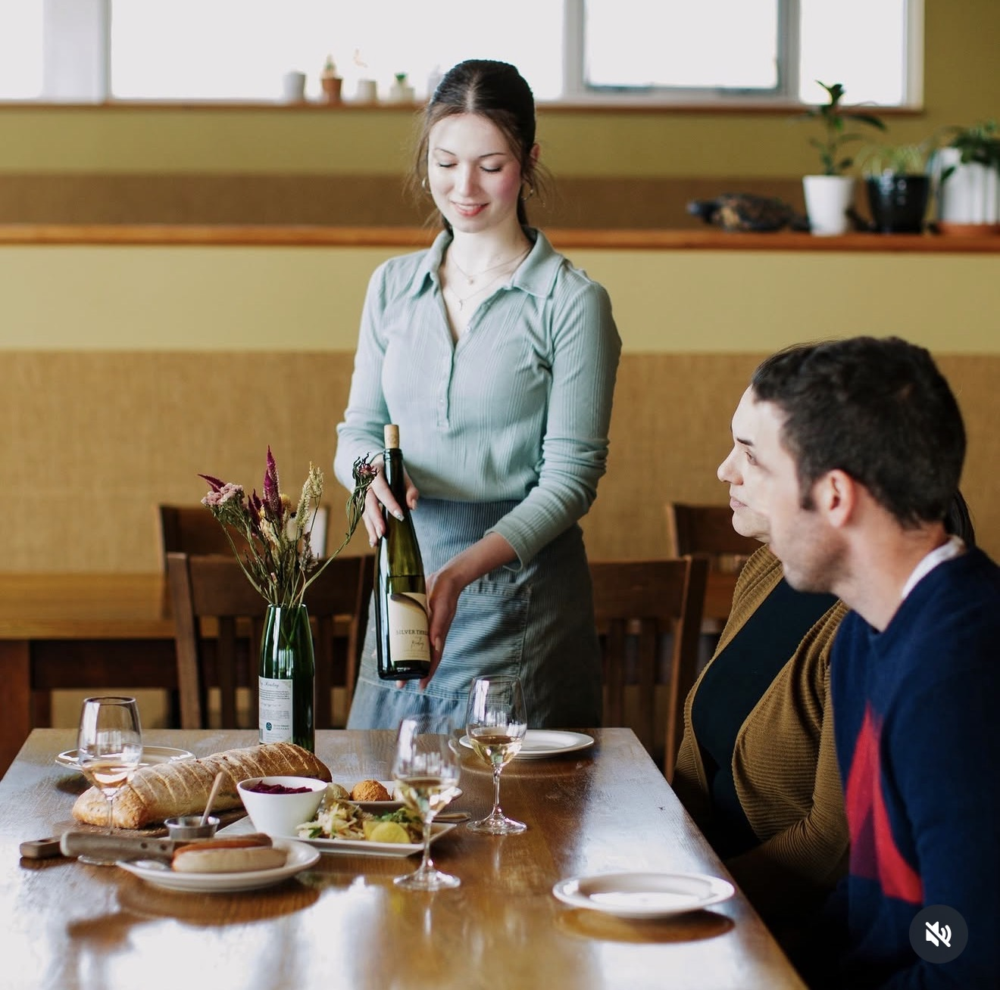
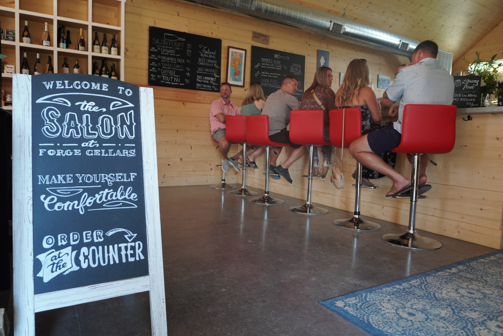

[index.html](https://github.com/user-attachments/files/29515680/index.html)<!DOCTYPE html>
<html lang="en">
<head>
  <meta charset="UTF-8" /><meta name="viewport" content="width=device-width, initial-scale=1.0" />
  <title>Osmote Wine | Burdett, NY – South East Seneca</title>
  <meta name="description" content="Osmote Wine in Burdett, NY — low-impact, naturally fermented Finger Lakes wines with estate vineyard tastings in a stunning timber-framed pavilion overlooking Seneca Lake." />
  <meta property="og:title" content="Osmote Wine | Burdett, NY" />
  <meta property="og:description" content="Low-impact, naturally fermented wines. Estate vineyard tastings in a timber-framed pavilion with panoramic Seneca Lake views. Appointments preferred." />
  <meta property="og:image" content="https://raw.githubusercontent.com/southeastseneca/Osmote/main/Hero.jpeg" />
  <link rel="preconnect" href="https://fonts.googleapis.com" /><link rel="preconnect" href="https://fonts.gstatic.com" crossorigin />
  <link href="https://fonts.googleapis.com/css2?family=Oswald:wght@400;500;600;700&family=Epilogue:ital,wght@0,300;0,400;0,500;0,600;1,300;1,400&display=swap" rel="stylesheet" />
  
  <svg style="display:none" xmlns="http://www.w3.org/2000/svg"><defs>
    <symbol id="icon-winery" viewBox="0 0 24 24" fill="none" stroke="#1e2729" stroke-width="1.6" stroke-linecap="round" stroke-linejoin="round"><path d="M8 3h8l-1.5 7a4 4 0 0 1-5 0L8 3z"/><line x1="12" y1="14" x2="12" y2="20"/><line x1="8" y1="20" x2="16" y2="20"/></symbol>
    <symbol id="icon-sun" viewBox="0 0 24 24" fill="none" stroke="#1e2729" stroke-width="1.6" stroke-linecap="round" stroke-linejoin="round"><circle cx="12" cy="12" r="4"/><line x1="12" y1="2" x2="12" y2="6"/><line x1="12" y1="18" x2="12" y2="22"/><line x1="4.22" y1="4.22" x2="7.05" y2="7.05"/><line x1="16.95" y1="16.95" x2="19.78" y2="19.78"/><line x1="2" y1="12" x2="6" y2="12"/><line x1="18" y1="12" x2="22" y2="12"/><line x1="4.22" y1="19.78" x2="7.05" y2="16.95"/><line x1="16.95" y1="7.05" x2="19.78" y2="4.22"/></symbol>
    <symbol id="icon-leaf" viewBox="0 0 24 24" fill="none" stroke="#1e2729" stroke-width="1.6" stroke-linecap="round" stroke-linejoin="round"><path d="M17 8C8 10 5.9 16.17 3.82 22"/><path d="M17 8c0 0 2 8-6 12"/><path d="M3.82 22C6 14 9 10 17 8"/></symbol>
    <symbol id="icon-star" viewBox="0 0 24 24" fill="none" stroke="#1e2729" stroke-width="1.6" stroke-linecap="round" stroke-linejoin="round"><polygon points="12,2 15.09,8.26 22,9.27 17,14.14 18.18,21.02 12,17.77 5.82,21.02 7,14.14 2,9.27 8.91,8.26"/></symbol>
    <symbol id="icon-pin" viewBox="0 0 24 24" fill="none" stroke="#1e2729" stroke-width="1.6" stroke-linecap="round" stroke-linejoin="round"><path d="M12 2a7 7 0 0 1 7 7c0 5-7 13-7 13S5 14 5 9a7 7 0 0 1 7-7z"/><circle cx="12" cy="9" r="2.5"/></symbol>
    <symbol id="icon-clock" viewBox="0 0 24 24" fill="none" stroke="#1e2729" stroke-width="1.6" stroke-linecap="round" stroke-linejoin="round"><circle cx="12" cy="12" r="9"/><polyline points="12,7 12,12 15.5,14"/></symbol>
    <symbol id="icon-car" viewBox="0 0 24 24" fill="none" stroke="#1e2729" stroke-width="1.6" stroke-linecap="round" stroke-linejoin="round"><path d="M5 11l1.5-4.5h11L19 11"/><rect x="3" y="11" width="18" height="7" rx="2"/><circle cx="7.5" cy="18" r="1.5" fill="#1e2729"/><circle cx="16.5" cy="18" r="1.5" fill="#1e2729"/></symbol>
    <symbol id="icon-phone" viewBox="0 0 24 24" fill="none" stroke="#1e2729" stroke-width="1.6" stroke-linecap="round" stroke-linejoin="round"><path d="M22 16.9v3a2 2 0 0 1-2.2 2 19.8 19.8 0 0 1-8.6-3.1 19.5 19.5 0 0 1-6-6 19.8 19.8 0 0 1-3.1-8.7A2 2 0 0 1 4.1 2H7a2 2 0 0 1 2 1.7c.1 1 .4 1.9.7 2.8a2 2 0 0 1-.5 2.1L8.1 9.9a16 16 0 0 0 6 6l1.3-1.3a2 2 0 0 1 2.1-.5c.9.3 1.8.6 2.8.7A2 2 0 0 1 22 16.9z"/></symbol>
    <symbol id="icon-globe" viewBox="0 0 24 24" fill="none" stroke="#1e2729" stroke-width="1.6" stroke-linecap="round" stroke-linejoin="round"><circle cx="12" cy="12" r="9"/><path d="M2 12h20"/><path d="M12 2a15.3 15.3 0 0 1 4 10 15.3 15.3 0 0 1-4 10 15.3 15.3 0 0 1-4-10 15.3 15.3 0 0 1 4-10z"/></symbol>
    <symbol id="icon-map" viewBox="0 0 24 24" fill="none" stroke="#1e2729" stroke-width="1.6" stroke-linecap="round" stroke-linejoin="round"><polygon points="3,6 9,3 15,6 21,3 21,18 15,21 9,18 3,21"/><line x1="9" y1="3" x2="9" y2="18"/><line x1="15" y1="6" x2="15" y2="21"/></symbol>
    <symbol id="icon-instagram" viewBox="0 0 24 24" fill="none" stroke="#1e2729" stroke-width="1.6" stroke-linecap="round" stroke-linejoin="round"><rect x="2" y="2" width="20" height="20" rx="5"/><circle cx="12" cy="12" r="4"/><circle cx="17.5" cy="6.5" r="0.8" fill="#1e2729" stroke="none"/></symbol>
    <symbol id="icon-calendar" viewBox="0 0 24 24" fill="none" stroke="#1e2729" stroke-width="1.6" stroke-linecap="round" stroke-linejoin="round"><rect x="3" y="4" width="18" height="18" rx="2"/><line x1="16" y1="2" x2="16" y2="6"/><line x1="8" y1="2" x2="8" y2="6"/><line x1="3" y1="10" x2="21" y2="10"/></symbol>
    <symbol id="icon-compass" viewBox="0 0 24 24" fill="none" stroke="#1e2729" stroke-width="1.6" stroke-linecap="round" stroke-linejoin="round"><circle cx="12" cy="12" r="9"/><polygon points="16.24,7.76 14.12,14.12 7.76,16.24 9.88,9.88" fill="#1e2729" stroke="none"/></symbol>
    <symbol id="icon-pen" viewBox="0 0 24 24" fill="none" stroke="#1e2729" stroke-width="1.6" stroke-linecap="round" stroke-linejoin="round"><path d="M17 3a2.8 2.8 0 1 1 4 4L7.5 20.5 2 22l1.5-5.5L17 3z"/></symbol>
    <symbol id="icon-repeat" viewBox="0 0 24 24" fill="none" stroke="#1e2729" stroke-width="1.6" stroke-linecap="round" stroke-linejoin="round"><polyline points="17,1 21,5 17,9"/><path d="M3 11V9a4 4 0 0 1 4-4h14"/><polyline points="7,23 3,19 7,15"/><path d="M21 13v2a4 4 0 0 1-4 4H3"/></symbol>
    <symbol id="icon-signature" viewBox="0 0 24 24" fill="none" stroke="#1e2729" stroke-width="1.6" stroke-linecap="round" stroke-linejoin="round"><path d="M3 17c3-2 5-5 7-9s4-6 6-3-2 8-1 10 4-2 6-4"/><line x1="3" y1="21" x2="21" y2="21"/></symbol>
    <symbol id="icon-hike" viewBox="0 0 24 24" fill="none" stroke="#1e2729" stroke-width="1.6" stroke-linecap="round" stroke-linejoin="round"><circle cx="13" cy="4" r="2"/><path d="M10 7l-3 5h4l-2 6 5-3"/><path d="M14 16l2 5"/><path d="M9 12l-2 7"/></symbol>
    <symbol id="icon-clipboard" viewBox="0 0 24 24" fill="none" stroke="#1e2729" stroke-width="1.6" stroke-linecap="round" stroke-linejoin="round"><rect x="5" y="4" width="14" height="17" rx="2"/><path d="M9 4a2 2 0 0 1 4 0"/><line x1="9" y1="10" x2="15" y2="10"/><line x1="9" y1="14" x2="13" y2="14"/></symbol>
    <symbol id="icon-warning" viewBox="0 0 24 24" fill="none" stroke="#1e2729" stroke-width="1.6" stroke-linecap="round" stroke-linejoin="round"><path d="M10.3 3.3L2 20h20L13.7 3.3a2 2 0 0 0-3.4 0z"/><line x1="12" y1="10" x2="12" y2="14"/><circle cx="12" cy="17" r="0.5" fill="#1e2729"/></symbol>
    <symbol id="icon-distillery" viewBox="0 0 24 24" fill="none" stroke="#1e2729" stroke-width="1.6" stroke-linecap="round" stroke-linejoin="round"><ellipse cx="12" cy="5" rx="7" ry="2"/><ellipse cx="12" cy="19" rx="7" ry="2"/><line x1="5" y1="5" x2="5" y2="19"/><line x1="19" y1="5" x2="19" y2="19"/><path d="M5 10c2-1.5 12-1.5 14 0"/><path d="M5 14c2 1.5 12 1.5 14 0"/></symbol>
  </defs></svg>
</head>
<body>

  

    

      
<svg style="width:13px;height:13px;"><use href="#icon-winery"/></svg>Winery · South East Seneca

      <h1>Osmote Wine</h1>
      
Low-impact, naturally fermented wines from a family-run Seneca Lake estate — poured in a timber-framed pavilion with panoramic lake views.

    

  

  

    
<svg><use href="#icon-pin"/></svg>Burdett, NY

    
<svg><use href="#icon-clock"/></svg>Summer Tastings · On the Hour

    
<svg><use href="#icon-leaf"/></svg>Low-Impact · Natural Fermentation

    
<svg><use href="#icon-star"/></svg>Michelin-Listed · Under 24,000 Bottles/Year

    
<svg><use href="#icon-sun"/></svg>Timber Pavilion · Seneca Lake Views

    
<svg><use href="#icon-calendar"/></svg>Appointments Preferred

  

  

    <main>

      <section id="about">
        
About

        <h2 class="section-title">Osmote Wine</h2>
        
Osmote is one of the most distinctive small wineries in the Finger Lakes — family-run, lake-shaped, and committed to producing balanced, low-impact wines that express the unique character of Seneca Lake without being forced into it. Winemaker Ben Riccardi holds a degree in oenology from Cornell University and spent multiple vintages in New Zealand and the south of France before bringing that experience back to Burdett.

        
The name Osmote is an homage to the moderating influence the lake exerts on the surrounding vineyards — the same force that keeps vines alive through brutal upstate winters and extends the growing season into autumn. Under 24,000 bottles are produced each year, sourced from carefully selected Seneca Lake vineyards alongside Osmote's own estate blocks planted in 2024 at 950 feet above sea level on the eastern shore.

        
The tasting experience is centered around a stunning timber-framed pavilion and slate stone patio overlooking panoramic Seneca Lake views and the farm below. Tastings begin on the hour, with guest numbers capped each session to ensure a genuine, intimate experience. Appointments are preferred. The wines — ranging from their beloved Pet Nat to Chardonnay, Cabernet Franc, Riesling, and hybrid varieties — have earned spots on Michelin-starred restaurant lists worldwide.

      </section>

      

        
<svg style="width:13px;height:13px;"><use href="#icon-pen" style="stroke:var(--amber)"/></svg>In Our Words

        <h3 class="story-title">Our Story</h3>
        

          
Osmote earns its reputation quietly — no tasting bar theatrics, no slick branding, just wines that are genuinely alive and a setting that rewards the trip. The pavilion is one of the most beautiful tasting spots on the east shore: timber-framed, open to the lake, and surrounded by the farm that makes it all possible.

          
The Pet Nat alone is worth the drive. It's become a Finger Lakes icon — pure orchard fruit, natural carbonation, that signature salty yellow plum finish. But the Chardonnay, the Cab Franc, and the hybrid blends show just how broadly talented Ben Riccardi is. This is small-production, serious winemaking that doesn't take itself too seriously. Exactly the kind of place that makes the east shore special.

        

        
<svg style="width:12px;height:12px;"><use href="#icon-signature" style="stroke:var(--amber)"/></svg>— South East Seneca

      

      <section id="highlights">
        
Why Visit

        <h2 class="section-title">What to Expect</h2>
        

          
<svg><use href="#icon-winery"/></svg><h4>Natural Winemaking</h4>
Naturally fermented, low-intervention wines built around freshness, texture, and balance — clarity over weight, energy over extraction.

          
<svg><use href="#icon-sun"/></svg><h4>Timber Pavilion &amp; Views</h4>
Architecturally stunning timber-framed pavilion and slate patio with panoramic Seneca Lake views and the farm and vineyard below.

          
<svg><use href="#icon-star"/></svg><h4>Michelin-Starred Presence</h4>
Osmote wines appear on Michelin-starred restaurant lists worldwide — a testament to the quality and distinctiveness of the lineup.

          
<svg><use href="#icon-leaf"/></svg><h4>Regenerative Viticulture</h4>
Estate blocks planted with modern disease-resistant varieties, managed with regenerative practices — pasture-raised pigs, orchards, and diverse gardens on-farm.

          
<svg><use href="#icon-winery"/></svg><h4>Hybrid Varieties</h4>
Osmote embraces both classic European varieties and modern disease-resistant hybrids — helping write the future of Finger Lakes viticulture.

          
<svg><use href="#icon-calendar"/></svg><h4>Intimate Tastings</h4>
Guest numbers capped each hour to preserve quality — tastings begin on the hour, appointments preferred for the best experience.

        

      </section>

      <section id="wines">
        
The Wines

        <h2 class="section-title">What's Pouring</h2>
        
Under 24,000 bottles produced annually — each wine a small-batch expression of Seneca Lake terroir, naturally fermented and built around balance you can feel.

        <ul class="wine-list">
          <li><strong>This Is Pet Nat ★</strong>The Osmote signature — crisp, natural sparkling with orchard fruit and that salty yellow plum finish. A Finger Lakes icon.</li>
          <li><strong>This Is Red Pet Nat</strong>Carbonic maceration Pet Nat — pomegranate, strawberry, violet, and earthy warmth. Disgorged under crown cap.</li>
          <li><strong>Chardonnay</strong>Cool-climate Chardonnay with orchard fruit, crème brûlée, and a clean, bright finish — elegant and food-friendly.</li>
          <li><strong>Riesling</strong>Balanced dry and semi-dry Riesling with a vein of minerality, lime zest, and taut acidity that defines the lake.</li>
          <li><strong>Cabernet Franc</strong>Light-bodied with cranberry, raspberry, black pepper, and florals — whole cluster fermented, built for versatility.</li>
          <li><strong>TTYL White Blend</strong>A wildly aromatic white blend — Tocai Friuliano and Traminette with skin contact, tropical fruit, and a dry rounded body.</li>
          <li><strong>DeChaunac</strong>A precious heirloom hybrid — bright red berry, black currant leaf, and a unique oak-fermented expression exclusive to Osmote.</li>
          <li><strong>Pocket Wine</strong>Osmote's approachable everyday pour — ask at the tasting for what's current in the lineup.</li>
        </ul>
        
<svg style="width:11px;height:11px;"><use href="#icon-warning"/></svg>Current availability at osmotewine.com — follow @osmotewine on Instagram for seasonal updates.

      </section>

      <section id="tips">
        
Plan Your Visit

        <h2 class="section-title">Tips for Visitors</h2>
        <ul class="tips-list">
          <li><svg><use href="#icon-calendar"/></svg>Appointments are preferred — tastings begin on the hour and guest numbers are capped. Book ahead at osmotewine.com for the best experience.</li>
          <li><svg><use href="#icon-winery"/></svg>Start with the Pet Nat — it's the Osmote greeting wine and one of the most distinctive sparkling wines produced in the Finger Lakes.</li>
          <li><svg><use href="#icon-sun"/></svg>The pavilion faces west toward Seneca Lake — late afternoon visits offer incredible light over the southern drumlins and the lake below.</li>
          <li><svg><use href="#icon-leaf"/></svg>Ask about the estate vineyard blocks — planted in 2024 at 950 feet elevation, these represent the next chapter in Osmote's story.</li>
          <li><svg><use href="#icon-star"/></svg>The wines punch well above their price point — Michelin-starred placement for bottles you can take home at cellar-door prices.</li>
          <li><svg><use href="#icon-car"/></svg>Located in Burdett on the east shore — easy to pair with a visit to Hillick &amp; Hobbs, Forge Cellars, or Watkins Glen State Park.</li>
        </ul>
      </section>

    </main>

    <aside class="sidebar">
      

        
<svg style="width:12px;height:12px;"><use href="#icon-clipboard"/></svg>Plan Your Visit

        

          
<svg><use href="#icon-pin"/></svg>
AddressBurdett, NY 14818 See osmotewine.com for exact address

          
<svg><use href="#icon-globe"/></svg>
Website<a href="https://www.osmotewine.com" target="_blank" rel="noopener">osmotewine.com</a>

          
<svg><use href="#icon-phone"/></svg>
Contact<a href="mailto:info@osmotewine.com">info@osmotewine.com</a>

          

          Tasting Hours
          <table class="hours-table">
            <tr><td>Summer Season</td><td>On the Hour</td></tr>
            <tr><td colspan="2" style="font-size:0.75rem;color:var(--muted);font-style:italic;padding-top:0.2rem;">Check osmotewine.com for current season schedule</td></tr>
          </table>
          Appointments preferred · Guest numbers capped each hour
          <a class="cta-btn" href="https://www.osmotewine.com/tastings" target="_blank" rel="noopener"><svg style="width:11px;height:11px;"><use href="#icon-calendar"/></svg>Book a Tasting</a>
          

            <a href="https://www.instagram.com/osmotewine" target="_blank" rel="noopener"><svg style="width:11px;height:11px;"><use href="#icon-instagram"/></svg>Instagram</a>
          

        

      

      

        
<svg style="width:12px;height:12px;"><use href="#icon-pin"/></svg>Location

        
<iframe src="https://www.google.com/maps/embed?pb=!1m18!1m12!1m3!1d2950!2d-76.8701!3d42.4539!2m3!1f0!2f0!3f0!3m2!1i1024!2i768!4f13.1!3m3!1m2!1s0x0%3A0x0!2sBurdett%2C+NY+14818!5e0!3m2!1sen!2sus!4v1" allowfullscreen loading="lazy" referrerpolicy="no-referrer-when-downgrade" title="Osmote Wine map"></iframe>

        
<svg style="width:11px;height:11px;"><use href="#icon-map"/></svg>Burdett, NY · East shore of Seneca Lake

      

      

        
<svg style="width:12px;height:12px;"><use href="#icon-compass"/></svg>Nearby Attractions

        

          
<svg><use href="#icon-winery"/></svg>
<strong>Hillick &amp; Hobbs Estate</strong>World-class dry Riesling on steep slate slopes above Seneca Lake

          
<svg><use href="#icon-winery"/></svg>
<strong>Forge Cellars</strong>Serious Riesling and Pinot Noir from 16 Seneca Lake vineyard sites

          
<svg><use href="#icon-distillery"/></svg>
<strong>Finger Lakes Distilling</strong>Region's first craft distillery — spirits, tours, and cocktails nearby

          
<svg><use href="#icon-hike"/></svg>
<strong>Watkins Glen State Park</strong>~6 miles south · 19 waterfalls and one of NY's most dramatic gorge trails

        

      

    </aside>
  

  

    

      
What's On

      <h2 class="section-title">Tastings &amp; Experiences</h2>
      

        

<svg style="width:10px;height:10px;"><use href="#icon-calendar"/></svg>Summer Season · On the Hour
<h4>Estate Pavilion Tasting</h4>
Intimate hillside tasting in the timber-framed pavilion above Seneca Lake. Tastings begin on the hour with guest numbers capped — appointments preferred for guaranteed entry.
<svg style="width:8px;height:8px;"><use href="#icon-repeat"/></svg>Seasonal

        

<svg style="width:10px;height:10px;"><use href="#icon-calendar"/></svg>Year-Round
<h4>Direct Wine Sales</h4>
Osmote wines available direct from the winery via Vinoshipper — buy online and ship to your door, or pick up at the farm during tasting season.
<svg style="width:8px;height:8px;"><use href="#icon-repeat"/></svg>Always Available

        

<svg style="width:10px;height:10px;"><use href="#icon-calendar"/></svg>Ongoing
<h4>Estate Vineyard Project</h4>
Osmote's own vineyard blocks — planted 2024 at 950 feet elevation on the eastern shore — are now producing their first estate fruit. A new chapter worth following.
<svg style="width:8px;height:8px;"><use href="#icon-repeat"/></svg>Evolving

        

<svg style="width:10px;height:10px;"><use href="#icon-calendar"/></svg>Year-Round
<h4>Mailing List &amp; Allocation</h4>
With under 24,000 bottles produced annually, some wines sell out quickly. Join the Osmote mailing list via osmotewine.com for early access and new release notifications.
<svg style="width:8px;height:8px;"><use href="#icon-repeat"/></svg>Always Open

      

    

  

  

    

      
Keep Exploring

      <h2 class="section-title">Your Next Stop</h2>
      
More exceptional wineries just up and down Route 414.

      

        <a href="https://southeastseneca.github.io/HillickHobbs/" target="_top" class="ke-card">
          

            
Winery · Burdett, NY

            
Hillick &amp; Hobbs Estate

            
World-renowned winemaker Paul Hobbs' Finger Lakes estate — limited-production dry Rieslings on steep slate slopes above Seneca Lake.

            
Explore →

          

        </a>
        <a href="https://southeastseneca.github.io/SilverThreadWinegarden/" target="_top" class="ke-card" style="padding:0;overflow:hidden;">
          

          

            
Winery · Lodi, NY

            
Silver Thread Winegarden

            
Sustainably farmed estate wines and food pairings at the new Winegarden on Route 414 — one of the Finger Lakes' most respected boutique wineries.

            
Explore →

          

        </a>
        <a href="https://southeastseneca.github.io/Forge-Cellars/" target="_top" class="ke-card" style="padding:0;overflow:hidden;">
          

          

            
Winery · Burdett, NY

            
Forge Cellars

            
World-class Riesling and Pinot Noir from 16 vineyard sites. Walk-in welcome in The Salon or book the Summer House for a guided cellar experience.

            
Explore →

          

        </a>
        <a href="https://southeastseneca.com" target="_top" class="ke-card ke-card-dark">
          

            🗺️
            
Full Directory

            
South East Seneca

            
Wineries, breweries, distilleries, restaurants, and experiences across the east shore of Seneca Lake.

            
Visit southeastseneca.com →

          

        </a>
      

    

  

  <footer class="page-footer">
    
<strong>Osmote Wine</strong> &nbsp;·&nbsp; Burdett, NY 14818 &nbsp;·&nbsp; <a href="https://www.osmotewine.com" target="_blank" rel="noopener">osmotewine.com</a> &nbsp;·&nbsp; Part of <a href="https://southeastseneca.com">South East Seneca</a>

    
© 2026 South East Seneca Lake Tourism. All rights reserved.

  </footer>
  
</body>
</html>
